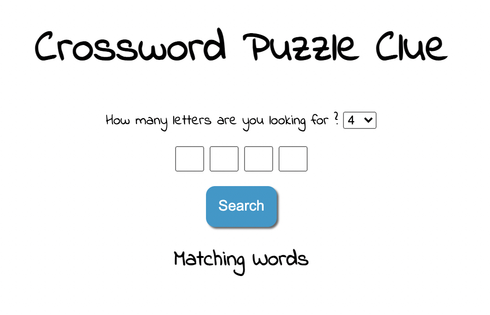

# Crossword-Clue

A simple in-browswer app that provides list of possible words for your crossword puzzles. User can select the word length and enter character hints and to search for possible matching words.

Build with vanilla CSS & JavaScript.
The app uses Datamuse's API (https://www.datamuse.com/api/) to query matching words given characters & word length.
