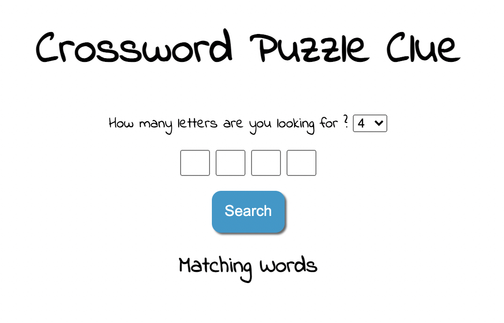
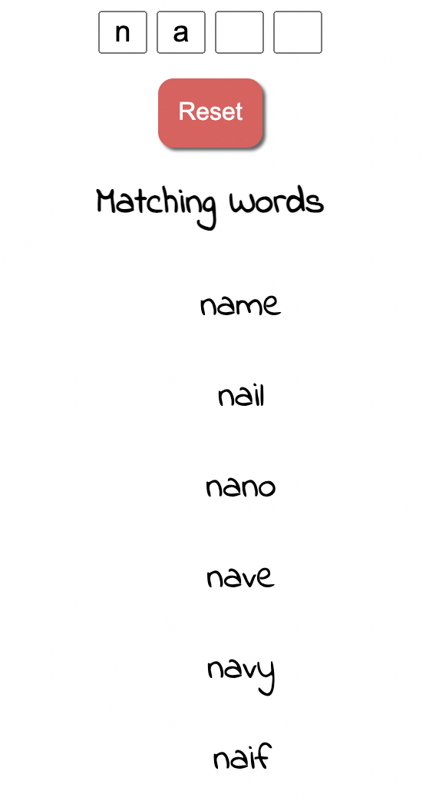

# Crossword-Clue

A simple in-browswer app that provides list of possible words for your crossword puzzles.
  User can select the word length and enter character hints and to search for possible matching words.

 

Build with HTML, CSS, vanilla JavaScript, and utilizing Datamuse API to retrieve matching words.  
Datamuse's API (https://www.datamuse.com/api/).

